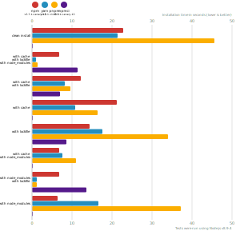
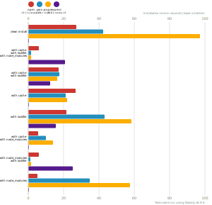
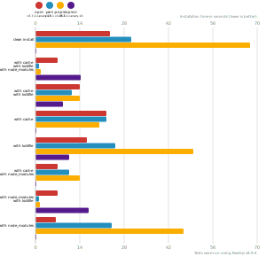
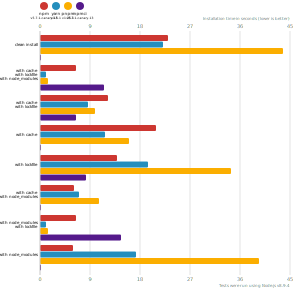
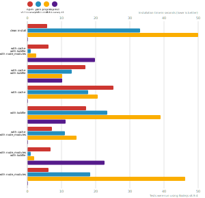

# Node package manager benchmark

This benchmark compares the performance of [npm](https://github.com/npm/npm), [npm ci](https://github.com/npm/npm/blob/latest/doc/cli/npm-ci.md) [pnpm](https://github.com/pnpm/pnpm) and [yarn](https://github.com/yarnpkg/yarn).

## React app

The app's `package.json` [here](./fixtures/react-app/package.json)

| action  | cache | lockfile | node_modules| npm i | npm ci | Yarn | pnpm |
| ---     | ---   | ---      | ---         | --- | --- | --- | --- |
| install |       |          |             | 22.8s | N/A | *21.4s* | 45.6s |
| install | ✔    | ✔        | ✔           | 6.7s | 11.3s | **1s** | 1.3s |
| install | ✔    | ✔        |             | 12.2s | *6.9s* | 8.2s | 9.5s |
| install | ✔    |          |             | 21.1s | N/A | **10.8s** | 16.3s |
| install |      | ✔        |             | 14.4s | **8.6s** | 17.6s | 33.9s |
| install | ✔    |          | ✔           | *6.7s* | N/A | 7.6s | 11s |
| install |      | ✔        | ✔           | 6.8s | 13.5s | *1.1s* | 1.2s |
| install |      |          | ✔           | **6.4s** | N/A | 16.6s | 37.2s |

## Ember app

The app's `package.json` [here](./fixtures/ember-quickstart/package.json)

| action  | cache | lockfile | node_modules| npm i | Yarn | pnpm | npm ci
| ---     | ---   | ---      | ---         | --- | --- | --- | --- |
| install |       |          |             | 27.3s | 42.5s | 1m 37.3s | N/A |
| install | ✔    | ✔        | ✔           | 6.1s | 1.6s | 1.7s | 20.8s |
| install | ✔    | ✔        |             | 17.3s | 17.4s | 16.3s | 12.3s |
| install | ✔    |          |             | 26.6s | 21s | 22.1s | N/A |
| install |      | ✔        |             | 21.5s | 43.3s | 58.2s | 15.5s |
| install | ✔    |          | ✔           | 5.5s | 9.8s | 14.1s | N/A |
| install |      | ✔        | ✔           | 6s | 1s | 1.7s | 25.1s |
| install |      |          | ✔           | 5.3s | 34.8s | 57.4s | N/A

## Angular app

The app's `package.json` [here](./fixtures/angular-quickstart/package.json)

| action  | cache | lockfile | node_modules| npm i | Yarn | pnpm | npm ci
| ---     | ---   | ---      | ---         | --- | --- | --- | --- |
| install |       |          |             | 23.6s | 30.3s | 1m 7.7s | N/A |
| install | ✔    | ✔        | ✔           | 6.9s | 1.1s | 1.6s | 14.3s |
| install | ✔    | ✔        |             | 14.1s | 11.6s | 13.9s | 8.6s |
| install | ✔    |          |             | 22.3s | 22.4s | 20.1s | N/A |
| install |      | ✔        |             | 16.1s | 25.1s | 49.8s | 10.5s |
| install | ✔    |          | ✔           | 7.1s | 10.6s | 13.9s | N/A |
| install |      | ✔        | ✔           | 7s | 1.1s | 1.4s | 16.9s |
| install |      |          | ✔           | 6.3s | 24.2s | 46.8s | N/A

## Medium Size App

The app's `package.json` [here](./fixtures/medium-size-app/package.json)

| action  | cache | lockfile | node_modules| tl;dr | npm i | Yarn | pnpm | npm ci
| ---     | ---   | ---      | ---         | --- | --- | --- | --- | --- |
| install |      | ✔        |             | clean install. Usually CI (default Travis config) | 13.9s | 19.4s | 34.3s | **_8.2s_** |
| install | ✔    | ✔        |             | refreshing node_modules/ locally, or CI configured to use global cache (not default on Travis) | 12.3s | 8.6s | 9.9s | **_6.5s_** |
| install |      | ✔        | ✔           | install after git pull, with cold cache | 6.4s | **_1s_** | 1.4s | 14.5s |
| install | ✔    | ✔        | ✔           | local dev install after git pull. On CI, if both node_modules and the global cache are configured (rare) | 6.4s | **_1s_** | 1.4s | 11.6s |
| install |       |          |             | upgrading a project with no lockfile. One-time operation. | 23s | **_22.1s_** | 43.8s | N/A |
| install |      |          | ✔           | upgrading a project with no lockfile. One-time operation. | **_5.9s_** | 17.3s | 39.5s | N/A
| install | ✔    |          | ✔           | upgrading a project with no lockfile. One-time operation. | **_6.1s_** | 7.1s | 10.6s | N/A |
| install | ✔    |          |             | upgrading a project with no lockfile. One-time operation | 20.9s | **_11.7s_** | 16s | N/A |

## Lots of Files

The app's `package.json` [here](./fixtures/alotta-files/package.json)

| action  | cache | lockfile | node_modules| npm i | Yarn | pnpm | npm ci
| ---     | ---   | ---      | ---         | --- | --- | --- | --- |
| install |       |          |             | 5.8s | 32.9s | 50s | N/A |
| install | ✔    | ✔        | ✔           | 6.1s | 987ms | 2.5s | 19.8s |
| install | ✔    | ✔        |             | 16.9s | 12.9s | 10.1s | 10.2s |
| install | ✔    |          |             | 25.1s | 17.7s | 20.5s | N/A |
| install |      | ✔        |             | 17.1s | 23.4s | 39s | 11.2s |
| install | ✔    |          | ✔           | 7.1s | 11s | 14.3s | N/A |
| install |      | ✔        | ✔           | 6.7s | 980ms | 1.9s | 22.6s |
| install |      |          | ✔           | 6.2s | 18.3s | 46.1s | N/A

